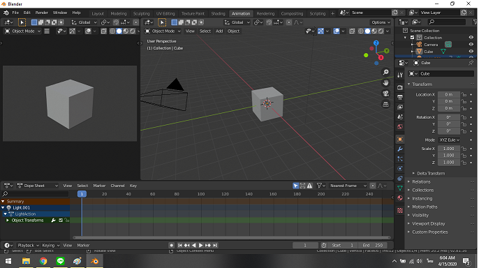
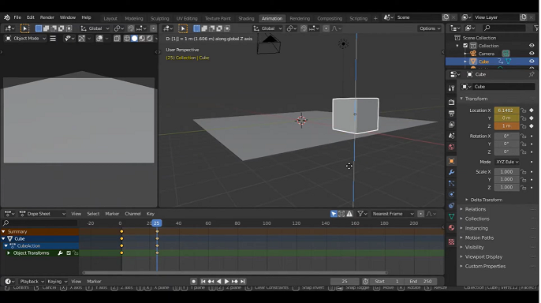

# การทำอนิเมชั่น

  ในบทเรียนนี้ จะทำการขยับ object ง่าย ๆ โดยใช้ Blender ที่เป็นโปรแกรมสำหรับการทำงานด้านแอนิเมชันอีกโปรแกรมหนึ่งที่ได้รับความนิยมไม่น้อย เรียกว่าเป็นโปรแกรมที่นักทำแอนิเมชันทั้งหลายรู้จักกันดีเลยก็ว่าได้

1. เลือก object ที่ต้องการขยับในที่นี้เลือกเป็น Cube ง่าย ๆ เข้าที่ Mode Animation จะเห็น tab ข้างล่างที่เป็น key frame ในการขยับ object แต่ละครั้ง

2. ย้ายกล่องไปยังตำแหน่งที่ต้องการจากนั้น insert key frame โดย กด I เลือก location 

3. ย้ายกล่องไปตามแนวแกน x หรือ y ตามต้องการเพื่อ เลือก key frame 25 กดที่เมนู key เลือก insert key frame แบบ all chanel

4. เพิ่ม object plane เป็นเหมือนพื้นให้กล่องเลื่อน

5. กดปุ่ม record กด R เพื่อหมุนตัวกล่อง เลือก key frameที่ 50 จากนั้นลากกล่องไปตำแหน่งตรงกลางของมุมกล้อง และยกเลิก Record

6. เมื่อกล่องอยู่กึ่งกลางของมุมกล้องแล้ว ให้ปรับขนาดของกล่องให้ใหญ่ขึ้นจากนั้นกด I และเลือก scalling 

7. ที่ frame ที่ 50 ให้กด record และ move กล่องบนแกน z จากนั้นเลือก frame ประมาณ 38 39และ move กล่องที่กึ่งกลางของกล้อง 

8. เลือก key frame กด G เพื่อย้ายกล่องมาใกล้ขึ้น

9. กดที่เมนู output เลือก file format เป็น FFmpeg VDO 

10. เลือก render เป็น animation

[Video ที่ render ออกมา](https://youtu.be/MzTevWYX4h4)

----
##การทำอนิเมชันแบบง่าย ๆ 

ดูนาทีที่ 12:27
1. ขั้นตอนแรกจะสร้างแท่งหนึ่งขึ้นมาจาก cube โดยขยาย cube ตามแนวแกน X
