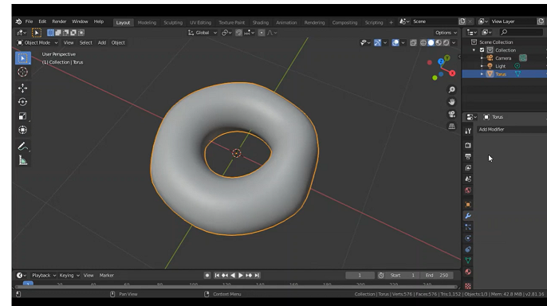
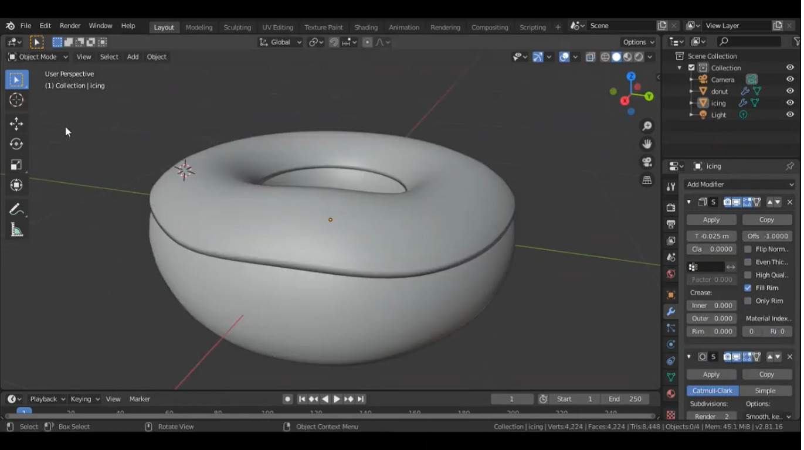
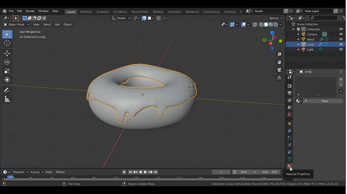

# การสร้าง Model และ Material
1. ในการสร้างโมเดลนั้น เราจะทำการสร้าง model โดนัทขึ้นมา โดยเริ่มจากการ Add object ที่มีรูปร่างคล้ายกับโดนัทให้มากที่สุดในที่เราเลือก Torus ปรับแก้ทรง เลือก shade smooth และ add modifier เป็น Subdivision surface ที่ตัว Torus เพื่อให้ดูคล้ายโดนัทมากขึ้น 

  

2. ทำตัว icing ของโดนัท โดย copy ส่วนบนของโดนัท (shif+d) ใน edit mode และตั้งชื่อ object ว่า icing จากนั้นปรับความหนาด้วยการ add modifier เลือก solidify ปรับ Thickess 

  

3. ทำ icing ย้อยลงมาโดยใช้ เครื่องมือ Extrusion โดยเลือกที่ icing แล้วทำการ subdivide จากนั้นเลือก Probposional editing เป็น Smooth และกด E เพื่อดัง icing ลงมา ปรับแต่งตามความต้องการ

  

4. ทำขอบโดนัทโดยใช้ sculpting mode และใช้เครื่องมือ Draw เพื่อทำให้รอบโดนัทเป็นร่อง และกลับไปสู่ layout เพื่อดึง icing ให้แนบติดกับตัวโดนัท

  

# Video การสร้าง model & Material
[Part 1](https://youtu.be/wDvkaw0JKzA)
[Part 2](https://youtu.be/i-4ih3UeJNA)
