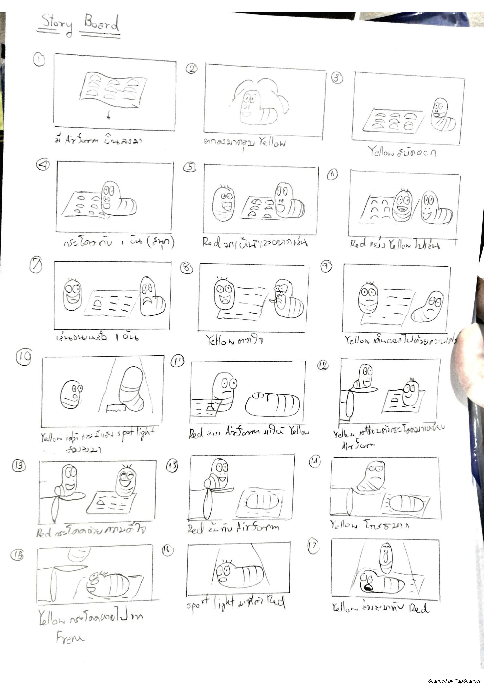
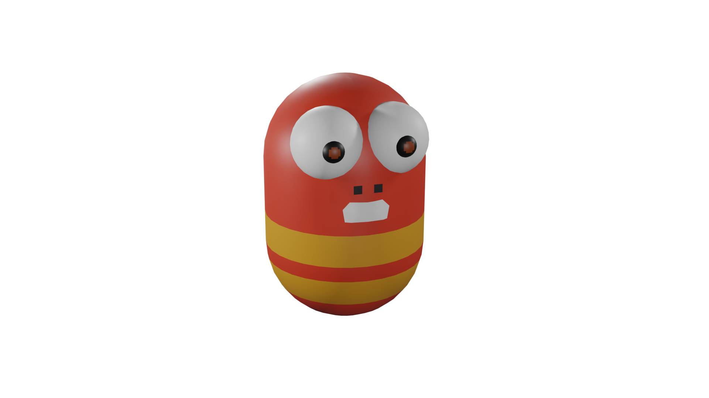
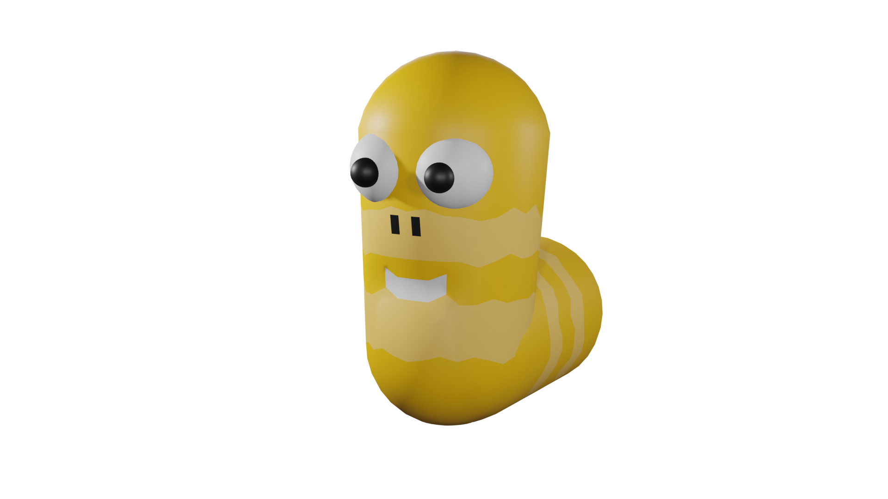
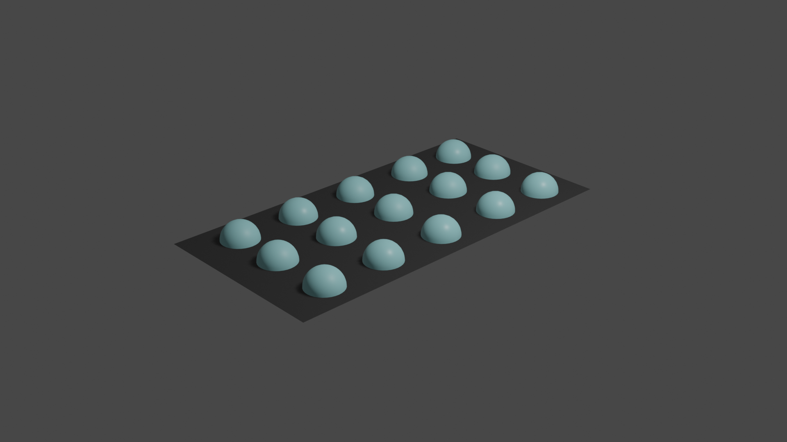

# Final Project
  
   ในโปรเจคสุดท้ายจะทำเป็น Animation ที่มี Reference มาจาก Animation เรื่อง Larva ที่จะมีหนอนสองตัวชื่อ Yellow กับ Red โดยมี Story Board ดังนี้ 
   
   
   
   จากนั้นทำการสร้าง Model Red Yellow และ Airform ขึ้นมา
      
   
   ขยับ model ตาม Story Board ข้างต้น แบ่งออกมาเป็น 3 Scene 
   
   [Scene 1](https://youtu.be/dETr6k40btI)
   [Scene 2](https://youtu.be/9E5URx4yLm0)
   [Scene 3](https://youtu.be/vNRiVgswI-g)
   
   นำไปตัดต่อใส่ Sound Effect และ Render ออกมา
   
   [Yellow and Red](https://youtu.be/pvDrq6euUPE)
   
