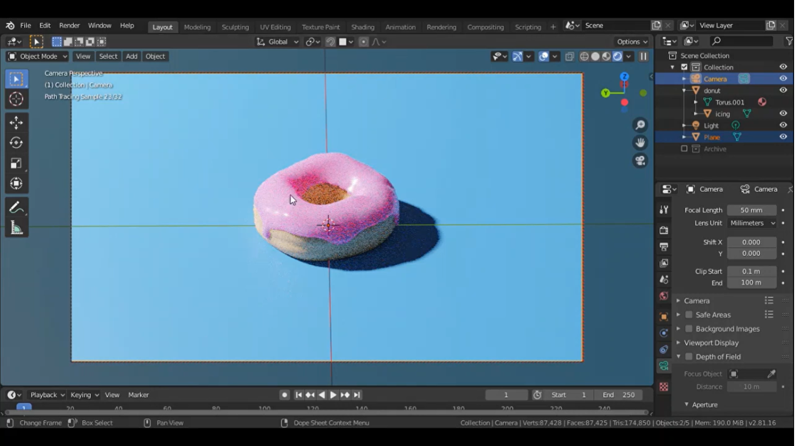
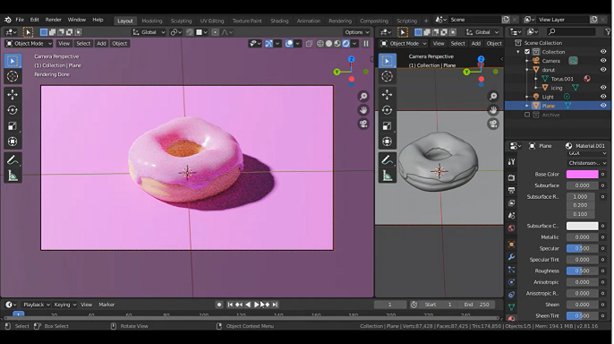
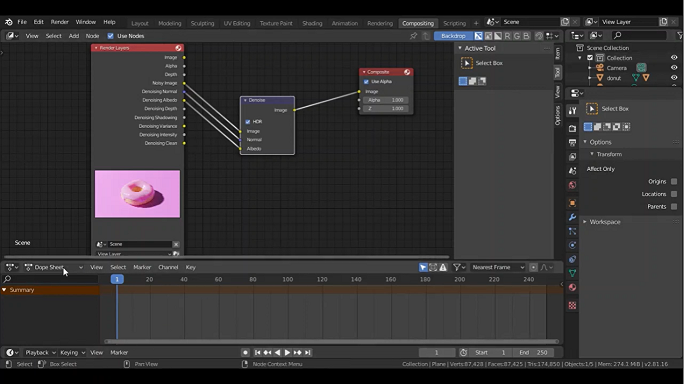

# การเรนเดอร์

1. วางโดนัทบน plane object กด 0 เพื่อปรับมุมกล้อง เมื่อ render ออกมาโดนัทที่ได้จะเหมือนกับภาพในตามมุมกล้องที่เราปรับ

2. ปรับ Render Engine เป็น Cycles จากนั้นเปลี่ยนสี plane icing และตัว donut และปรับ subsurface 

3. ปรับ lignt โดยเลือกแบบ point และปรับ power ตามต้องการ

4. ลบ noise ออกจากโดนัท โดยเข้าที่ Compositing mode คลิกขวาที่พื้นที่ว่าง ๆ หาคำว่า denoise เชื่อมระหว่าง Render layers กับ Composite ปรับ UV editing 

5. กด F12 เพื่อ Render ตัว Donut ออกมา

